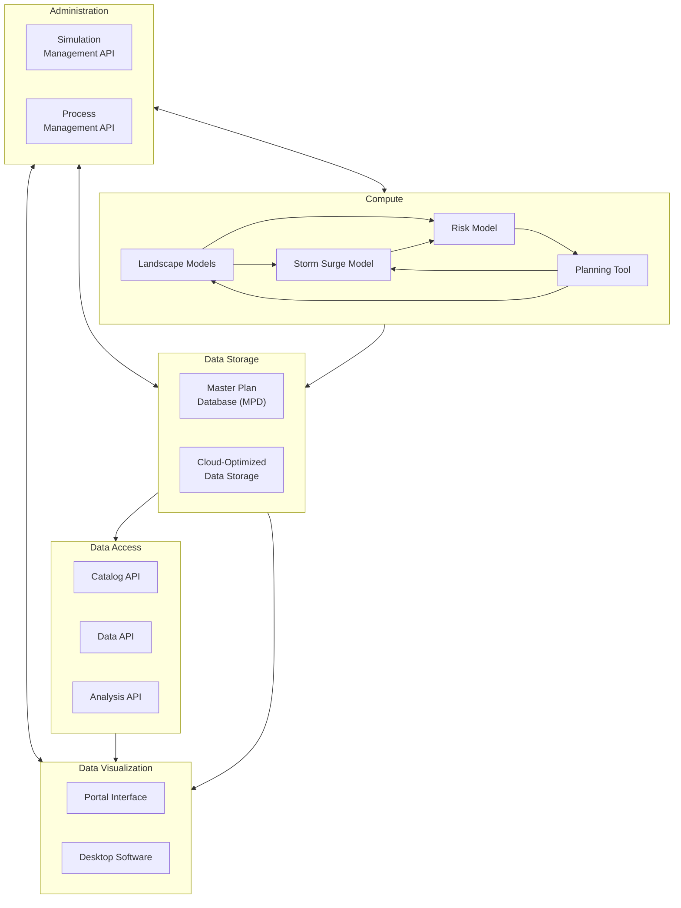

# Master Plan 2029 Technical Requirements

## Architecture Overview

```mermaid
flowchart TD
    subgraph A[Administration]
        SM[Simulation\nManagement API]
        PM[Process\nManagement API]
    end
    subgraph C[Compute]
        LM[Landscape Models]
        LM --> SSM[Storm Surge Model]
        LM --> RM[Risk Model]
        SSM --> RM
        RM --> PT[Planning Tool]
        PT --> SSM
        PT --> LM
    end
    subgraph DS[Data Storage]
        MPD["Master Plan\nDatabase (MPD)"]
        CODS[Cloud-Optimized\nData Storage]
    end
    subgraph DA[Data Access]
        Catalog[Catalog API]
        Data[Data API]
        Analysis[Analysis API]
    end
    subgraph DV[Data Visualization]
        PI[Portal Interface]
        DeS[Desktop Software]
    end
    A <--> C
    A <--> DS
    C --> DS
    DS --> DA
    A <--> DV
    DA --> DV
    DS --> DV
```

